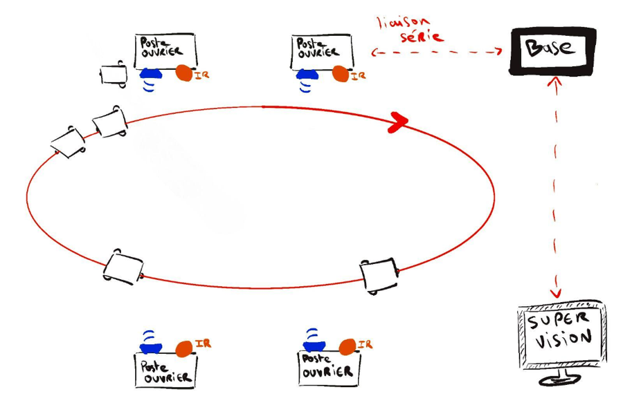

# Télémètre ultrason 40 kHz — LPC1769 (C bare-metal)

[](https://github.com/chabanechaouchemohand004-ctrl/lpc1769-ultrasonic-rangefinder/actions/workflows/build.yml)

Mesure de distance par temps de vol d'une salve ultrason, pour un robot mobile.
Émission, chaîne de réception analogique et firmware C sans HAL ni bibliothèque : accès direct aux registres du LPC1769 (Cortex-M3).

**Projet d'équipe de 6 personnes, 15 jours, présenté en soutenance (L3 EEA, UE 3EE206, Sorbonne Université).**
**Module dont j'avais la charge : le télémètre** — frontal analogique d'émission et de réception, firmware bare-metal et simulation.

## Statut

| | |
|---|---|
| Théorie | Validée : la simulation de la chaîne analogique et les tests sur PC (TIMER1 simulé) donnent les résultats attendus. |
| Pratique | Plus difficile que la théorie. Le montage a fonctionné en partie pendant le projet de cours, sans validation de bout en bout et sans capture d'oscilloscope. |
| Pas fait | Validation sur maquette avec le transducteur réel (voir « Pistes d'amélioration »). |
| Origine du code | Le firmware de ce dépôt est ma version reprise après le cours : build GCC, intégration continue, FIFO UART, tests sur PC. Ce n'est pas le code exact qui a tourné sur le robot. |

Les autres modules du robot (induction, DTMF, infrarouge, liaison base-poste-supervision) ont été réalisés par les autres membres de l'équipe et ne sont pas dans ce dépôt.

## Démarrage rapide

Toolchain requise : `arm-none-eabi-gcc` (firmware) et `gcc` (tests sur PC).

```
make -C firmware test    # tests sur PC, sans carte
make -C firmware         # -> firmware/build/rangefinder.elf / .bin / .hex
```

## Contexte

Des robots suivent un fil au sol et transportent des colis entre des postes ouvriers.
Une base centrale et un poste de supervision pilotent le système par liaison série.
Le télémètre permet au robot de détecter un obstacle devant lui.



## Chiffres clés

| | |
|---|---|
| Fréquence ultrason | 40 kHz, salve de 8 périodes (200 µs) |
| Portée (objectif de conception, non mesuré) | 5 à 250 cm |
| Résolution du chronométrage | 40 ns (TIMER1 à 25 MHz) |
| Cadence de mesure | 10 / 15 / 20 / 25 Hz (2 interrupteurs) |
| Filtre de réception | RLC série 100 µH / 160 nF, soit f0 ≈ 39,8 kHz |
| Amplification | ×300 (deux étages TL082, ×10 puis ×30) |
| Détection | détecteur de crête, puis comparateur LM311 (seuil Vref = 6 V) |
| Debug | UART0 à 115200 bauds, 4 modes |

La portée minimale de 5 cm vient du banc de test sur PC. Un transducteur 40 kHz oscille souvent 0,5 à 1 ms après la salve : avec 1 ms de résonance résiduelle, la portée minimale réelle est d'environ 17 cm (343 × 0,001 / 2).
La démo de la soutenance utilisait 9600 bauds ; cette version utilise 115200 bauds.

## Architecture


### Séquence de mesure


Toute la mesure est gérée par **un seul timer (TIMER1)** en interruption, sans attente active :

1. **Salve** : le match `MR0` bascule P2.13 toutes les 12,5 µs (312 puis 313 ticks, soit 40,000 kHz exactement).
2. **Zone aveugle (290 µs)** : la capture est coupée pour ignorer le couplage direct entre l'émetteur et le récepteur,
   ainsi que les oscillations résiduelles du transducteur après la salve.
3. **Écoute** : la capture `CAP1.0` enregistre dans `CR0` l'instant du front montant du comparateur.
   Le temps de vol vaut `CR0 − t0`, et la distance `d = c·t/2`.
4. **Hors portée** : le match `MR1` arrête l'écoute à 14,5 ms, soit 250 cm.

L'instant de l'écho est horodaté **par le matériel** (capture) : il ne dépend pas de la latence d'interruption.
Les fronts de la salve, eux, sont écrits dans l'interruption `MR0` : ils ont un retard de quelques dizaines de cycles, quasi constant.

Le reste du firmware :

- **TIMER0** donne la cadence des mesures.
- **UART0** envoie les trames sans bloquer, grâce à une FIFO circulaire de 256 octets.
- La commande `DBG0`…`DBG3` reçue sur l'UART change le mode de debug.

| Interrupteurs DBG | Trame envoyée |
|---|---|
| 00 | `T 102 cm` |
| 01 | `T0x0243B0` (temps de vol brut, en ticks de 40 ns) |
| 10 | `T 10 mes/sec` |
| 11 | aucune trame (mode commande `DBGx` sur l'UART) |

## Simulation de la chaîne de réception

Écho à 1 m : le signal traverse le filtre RLC, les deux étages d'amplification, le détecteur de crête et le comparateur.
**La détection a lieu à 5,936 ms**, pour 5,83 ms théoriques à 343 m/s.
L'écart d'environ 0,1 ms vient du temps de montée du détecteur de crête et peut se compenser par une calibration.


## Tests (sur PC, sans carte)

`firmware/test/` simule TIMER1 tick par tick et appelle les interruptions comme le ferait le matériel :

```
$ cd firmware/test && make
salve : 16 fronts, 7 periodes = 4375 ticks -> 40000.0 Hz
echo a 5,936 ms : tof = 148400 ticks (5.936 ms) -> 1018 mm
couplage a 100/250 us ignore, echo a 1 ms -> 171 mm
pas d'echo -> hors portee apres 14.50 ms
echo a 291 us (distance min) -> 49 mm
UART0 : 115741 bauds (cible 115200)
ALL TESTS PASSED (0 failures)
```

Le test couvre aussi le débordement du compteur 32 bits de TIMER1 pendant une mesure.

## Brochage (LPC1769)

| Signal | Broche | Rôle |
|---|---|---|
| Salve ultrason | P2.13 (GPIO) | entrée du driver IR2304 |
| Écho | P1.18 (CAP1.0) | sortie du comparateur LM311 |
| Marche / arrêt | P0.30 | interrupteur* |
| Fréquence de mesure | P0.28, P0.29 | interrupteurs* |
| Mode de debug | P1.30, P1.31 | interrupteurs (pull-up interne) |
| LED de mesure | P0.22 | allumée pendant chaque mesure |
| UART0 | P0.2 (TX), P0.3 (RX) | trames de debug |

\* P0.28 est open-drain et P0.29/P0.30 n'ont pas de pull-up interne : ces trois broches demandent une résistance de tirage externe.

## Compiler

**En ligne de commande (GCC, sans Keil)** :

```
$ sudo apt install gcc-arm-none-eabi
$ make -C firmware          # -> firmware/build/rangefinder.elf / .bin / .hex
$ make -C firmware test     # tests sur PC
```

- Le `.bin` reçoit automatiquement la somme de contrôle exigée par la ROM de boot LPC17xx (`tools/lpc_checksum.py`).
- Firmware complet : environ 2 Ko de flash.
- L'intégration continue (`.github/workflows/build.yml`) lance les tests et la compilation à chaque push.

**Avec Keil µVision 5** : projet pour LPC1769 (*CMSIS Core* + *Device Startup*), puis ajouter les fichiers de `firmware/src/`.

Horloge : CCLK = 100 MHz (`system_LPC17xx.c`), PCLK = 25 MHz.

## Pistes d'amélioration

- Ajuster la zone aveugle sur banc (`MIN_CM` dans `board.h`) : un transducteur 40 kHz oscille souvent 0,5 à 1 ms après la salve, plus que les 290 µs actuelles.
- Seuil adaptatif ou gain croissant dans le temps, car l'écho s'atténue avec la distance.
- Correction de la vitesse du son en fonction de la température (+0,6 m/s par °C).
- Valider sur maquette, avec captures d'oscilloscope de la salve, de l'écho et de la sortie du comparateur, puis mesurer la portée minimale réelle.

## Structure

```
firmware/src/      main.c · ultrasonic.c (salve + temps de vol) · uart0.c · board.h (brochage)
firmware/test/     tests sur PC du module ultrasonic.c (registres simulés)
firmware/startup/  démarrage, script d'édition de liens, system_LPC17xx.c
firmware/cmsis/    en-têtes CMSIS et LPC17xx
tools/             somme de contrôle de l'image flash
docs/              chaîne de mesure, séquence, simulation
```
