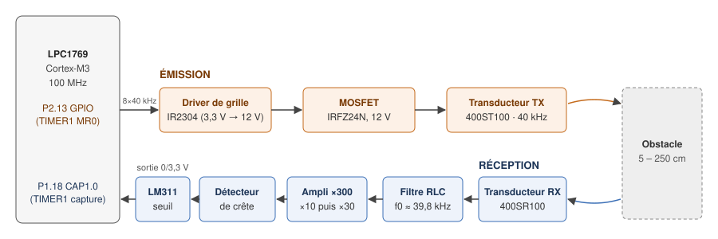
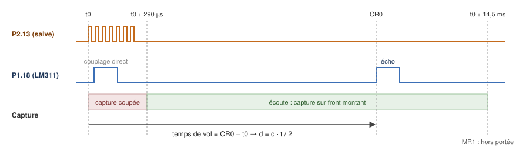
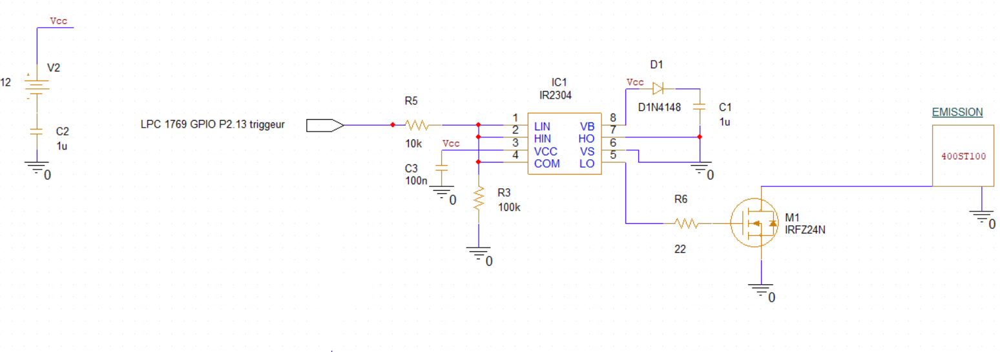
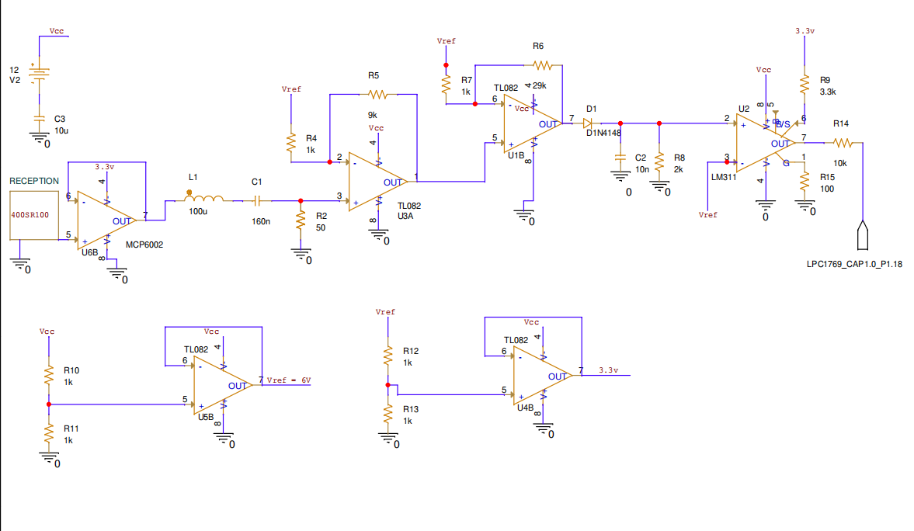
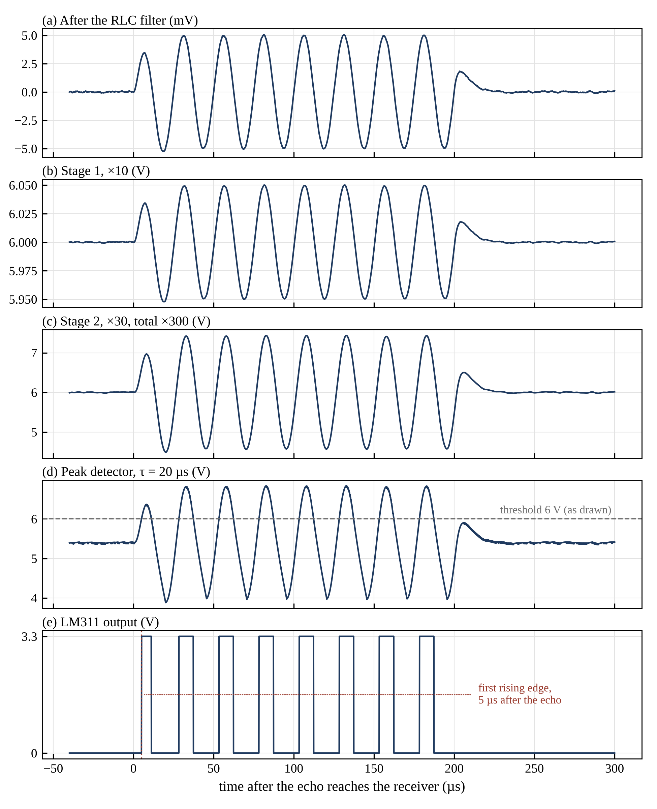

# 40 kHz ultrasonic rangefinder on LPC1769

[](https://github.com/chabanechaouchemohand004-ctrl/lpc1769-ultrasonic-rangefinder/actions/workflows/build.yml)

Time-of-flight rangefinder for a wire-following delivery robot: TX and RX circuits plus register-level C firmware on an NXP LPC1769 (Cortex-M3), no HAL. L3 EEA group project (UE 3EE206, Sorbonne Université), one module per student: **the rangefinder is my module, built on my own.**

- **Tools:** OrCAD, arm-none-eabi-gcc, Make, Keil µVision 5, GitHub Actions, Python.
- **Flow:** TIMER1 match → 40 kHz burst → IR2304 + MOSFET → transducer; echo → MCP6002 buffer → RLC filter → 2 × TL082 (×300) → peak detector → LM311 → TIMER1 hardware capture → distance → UART.
- **Results:** firmware flashed on the LPC1769 board, distance sent to a PC over UART; TX and RX built and checked at **10 and 20 cm**; 40.000 kHz burst; 1 988 bytes of flash; PC tests pass.

The firmware in this repo is the post-course version (GCC build, CI, UART FIFO, PC tests). The course version ran on the board, built and flashed with Keil µVision 5.

| Tool | Use |
| --- | --- |
| OrCAD | Schematics of the TX and RX circuits, simulation |
| arm-none-eabi-gcc, Make | Firmware build (`.elf`, `.bin`, `.hex`) |
| Keil µVision 5 | Course version: build and flash |
| gcc | PC tests of the measurement logic |
| GitHub Actions | Tests and build on every push |
| Python (numpy, scipy, matplotlib) | Receive-chain model |

## 1. Key figures

| Item | Value |
| --- | --- |
| Ultrasound | 40 kHz, 8-period burst (200 µs) |
| Range | 5-250 cm (specification) |
| Timing resolution | 40 ns (TIMER1 at 25 MHz) |
| Measurement rate | 10 / 15 / 20 / 25 Hz (2 switches) |
| Receive filter | Series RLC 100 µH / 160 nF, f0 ≈ 39.8 kHz |
| Gain | ×300 (two TL082 stages, ×10 then ×30) |
| Detection | Peak detector (D + 10 nF // 2 kΩ, τ = 20 µs), then LM311 comparator (threshold from a resistor divider, 6 V as drawn in the schematic; 3.3 V pull-up) |
| Debug | UART0 at 115200 baud, 4 modes |

## 2. Architecture

**Measurement chain:**



**Timing of one measurement:**



One timer (TIMER1) runs the whole measurement in interrupts, with no busy-wait:

1. **Burst:** match `MR0` toggles P2.13 every 12.5 µs (312 then 313 ticks: exactly 40.000 kHz).
2. **Blind zone (290 µs):** capture disabled to ignore direct TX → RX coupling.
3. **Listen:** capture `CAP1.0` stores the comparator's rising edge in `CR0`. Time of flight = `CR0 − t0`, distance d = c·t/2.
4. **Out of range:** match `MR1` stops listening at 14.5 ms (250 cm).

The echo time is stamped **in hardware** (capture), so it does not depend on interrupt latency.

- **TIMER0** sets the measurement rate.
- **UART0** sends frames without blocking through a 256-byte circular FIFO.
- `DBG0`…`DBG3` received on the UART switch the debug mode.

| DBG switches | Frame sent |
| --- | --- |
| 00 | `T 102 cm` |
| 01 | `T0x0243B0` (raw time of flight, 40 ns ticks) |
| 10 | `T 10 mes/sec` |
| 11 | none (`DBGx` command mode on the UART) |

## 3. Schematics and receive-chain model

**Emission:** GPIO P2.13 → IR2304 gate driver → IRFZ24N → 400ST100 transducer (OrCAD).



**Reception:** 400SR100 → MCP6002 buffer → RLC filter → 2 × TL082 → peak detector → LM311 → P1.18 (OrCAD).



**Receive-chain model, echo of a target at 1 m:** a Python reconstruction (`analysis/receive_chain_model.py`) with the component values of the reception schematic. Model assumptions: 5 mV echo, 0.3 mV rms noise, ideal op-amps, diode and comparator.



- Echo of a target at 1 m: 5.831 ms. First comparator edge at 5.836 ms for a 5 mV echo; 4 to 31 µs later for echoes of 10 to 2.5 mV (0.5 cm at most).
- τ = 20 µs is close to the 25 µs period, so the comparator pulses once per cycle. The firmware uses the first rising edge.

## 4. Firmware tests on PC

`firmware/test/` runs `ultrasonic.c` on the PC with a simulated TIMER1: it advances the timer tick by tick and calls the interrupt handlers as the hardware would, including the 32-bit counter overflow.

```text
$ cd firmware/test && make
salve : 16 fronts, 7 periodes = 4375 ticks -> 40000.0 Hz
echo a 5,936 ms : tof = 148400 ticks (5.936 ms) -> 1018 mm
couplage a 100/250 us ignore, echo a 1 ms -> 171 mm
pas d'echo -> hors portee apres 14.50 ms
echo a 291 us (distance min) -> 49 mm
UART0 : 115741 bauds (cible 115200)
ALL TESTS PASSED (0 failures)
```

## 5. Pinout (LPC1769)

| Signal | Pin | Role |
| --- | --- | --- |
| Ultrasound burst | P2.13 (GPIO) | IR2304 driver input |
| Echo | P1.18 (CAP1.0) | LM311 comparator output |
| On / off | P0.30 | switch* |
| Measurement rate | P0.28, P0.29 | switches* |
| Debug mode | P1.30, P1.31 | switches (internal pull-up) |
| Measurement LED | P0.22 | on during each measurement |
| UART0 | P0.2 (TX), P0.3 (RX) | debug frames |

\* P0.28 is open-drain and P0.29/P0.30 have no internal pull-up: these three pins need an external pull resistor.

## Build

```bash
sudo apt install gcc-arm-none-eabi
make -C firmware          # -> firmware/build/rangefinder.elf / .bin / .hex
make -C firmware test     # PC tests
pip install -r requirements.txt
python3 analysis/receive_chain_model.py   # -> docs/simulation-chaine.png
python3 analysis/diagrams.py              # -> docs/chaine.svg, docs/sequence.svg
```

- The `.bin` gets the LPC17xx boot-ROM checksum automatically (`tools/lpc_checksum.py`).
- CI (`.github/workflows/build.yml`) runs the tests and the build on every push.
- Clocks: CCLK = 100 MHz, PCLK = 25 MHz.

## Repository layout

```text
firmware/src/      main.c, ultrasonic.c (burst + time of flight), uart0.c, board.h (pinout)
firmware/test/     PC tests of ultrasonic.c (simulated registers)
firmware/startup/  startup code, linker script, system_LPC17xx.c
firmware/cmsis/    CMSIS and LPC17xx headers
analysis/          Python: receive-chain model, diagrams, shared plot style
tools/             flash image checksum
docs/              measurement chain, timing, schematics, model figure
```

## Credits

Course handout: specification of the robot and its modules. Schematics, firmware, simulation and tests: mine.
The other robot modules (induction, DTMF, infrared, base-station link, wire injection) were done by other students and are not in this repo.
